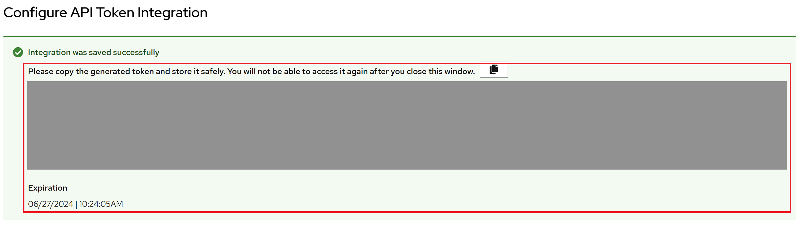

# RH ACS Policy and Pipeline Configuration

## Overview
This page will cover how to configure Red Hat ACS (Advanced Cluster Security) integration with Quay, and subsequently use the available tekton tasks for image scanning and policy checks.

## Prerequisites
Here are the following prerequisities prior to proceeding:

* Red Hat ACS must be installed
* ACS Scanner is configured
* Running Internal Quay Repository

## Generate Quay OAuth Token

Login to Quay and select an organization

Click the `Applications` tab and click `Create New Application`


Fill out the `Application Name`, click the `Generate Token` and select `View all visible repositories`


Click `Generate Access Token`


Note: Make sure to set aside the Access Token as this will be used for Red Hat ACS Quay Integration

## Integration

To integrate Quay registry and scanner, head over to the RH ACS Central endpoint located in `stackrox` namespace.


Once logged in, proceed to `Platform Configuration -> Integrations` tab and select Quay.io:


Click `New Integration` then fill out the following details:

| Name | Value |
| --- | --- |
| Integration Name | `<quay repository name>` |
| Type | Registry + Scanner |
| Endpoint | `<your quay repository>` |
| OAuth Token | `generated OAuth token from Quay`|
| Disable TLS Certificate Validation (Insecure) | [✔] |

Click `Test` prior to saving to check whether the configuration was correct


Proceed to `Save` the integration

## Generate Red Hat ACS API Token

Now that both Quay and ACS has been integrated, proceed with generating `Stackrox API Token` under `Authentication Tokens` tab


Click `Generate Token` and fill out the details


Make sure to select the `Continuous Integration` role

Then select `Generate` and the token will be displayed and available for copying (set the token aside for pipeline use)



Note: It can only be copied once and will expire in a year's time so please be mindful when keeping track of generated API tokens

## Initial Pipeline Setup

The image scan and policy check Tekton tasks can be found here:

| Task Name | URL |
| --- | --- |
| `rhacs-image-scan` | https://hub.tekton.dev/tekton/task/rhacs-image-scan |
| `rhacs-image-check` | https://hub.tekton.dev/tekton/task/rhacs-image-check |

### Generate Secrets for Tekton Tasks

Use the generated API token that was set aside and store it in a secret in the desired namespace:

```
$ ROX_API_TOKEN=eyJ...
$ oc create secret generic rox-secrets \
  --from-literal=rox_api_token="$ROX_API_TOKEN" \
  --from-literal=rox_central_endpoint=central.stackrox.svc:443
```

### Establish Pipeline

Copy the tasks from the source URL and create the tasks and pipeline:
```
    pipeline
    ├── image-validation-pipelinerun.yaml
    ├── image-validation-pipeline.yaml
    ├── kustomization.yaml
    ├── pvc
    │   └── pvc-image-validation-storage.yaml
    └── task
        ├── kustomization.yaml
        ├── task-buildah-pull.yaml
        ├── task-rhacs-image-check.yaml
        └── task-rhacs-image-scan.yaml
```

Apply the following manifests to establish the pipeline resources in any selected namespace (in this scenario, I used `logging-test` as the namespace):

```
$ oc apply -k . -n logging-test
```

Once the manifests has been created, the pipeline should now be available for running:


The following pipeline can now be run using pipelinerun or establishing pipeline triggers:

```
# pipelinerun

$ oc create -f ./image-validation-pipelinerun.yaml
```

Once the pipeline has finished running, results can the be viewed to confirm if the image validation worked


Check the failed task


The policy has failed the pipeline due to Policy `Fixable Severity at least Important`

## Configuring Policies in Red Hat ACS

After encountering the policy that stopped the pipeline, the policy can be revised in the ACS Central UI

Go to `Configuration Management` and click the Policies 


Look for `Fixable Severity at least Important` policy and click it to view further details


As stated in the policy, it has a `High` severity rating and it is both enabled and enforced, affecting both build and deployment lifecycle of the image.

When implemented as part of the pipeline, policies such as these can be easily used to validate the image prior to its deployment.

Let's try a few ways of updating the policy to enable the policy check to proceed.

### Disable Policy

The policy can be easily diabled by heading over to `Policy Management` under `Platform Configuration` tab


Click `Actions -> Edit Policy`, then in the `Policy Behavior` change the Response Method to `Inform` to disable `Enforce on Build`


Click `Next` until Review Policy section is reached and press `Save` 

### Exclude Image

The policy scope can also be configured to exclude images to ensure that the policy violation will not be flagged and stop the CI build


Click `Next` until Review Policy section is reached and press `Save`

### Rerun Pipeline

After the policy has been configured, the pipeline can now be rerun without the policy violation.

